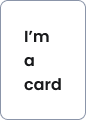
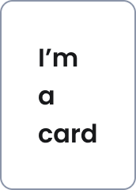

# Card 

import { Tabs, TabItem } from '@astrojs/starlight/components';

[Web URL](https://zeroheight.com/98bb1df01/v/latest/p/256920-card)
The Card component serves as a versatile container for grouping content and actions, allowing users to engage with and access information more effectively

## Interactive Example

:::tip[Interactive Testing]
Use the interactive component below to test different states, props, and variations. Toggle between the live component and code examples to understand implementation details.
:::

<Tabs>
<TabItem label="Live Component">
<iframe
  src="https://penny.melio.com/?path=/story/containers-cards-card--main"
  width="100%"
  height="500px"
  frameBorder="0"
  allow="clipboard-write"
  style="border: 1px solid #e1e5e9; border-radius: 8px; margin: 16px 0;"
  title="Card Interactive Example">
</iframe>
</TabItem>

<TabItem label="Code Examples">
```jsx
// Basic Card
<Card>
  <h3>Card Title</h3>
  <p>This is the main content of the card.</p>
</Card>

// Card with Header and Actions
<Card
  label="Payment Method"
  mainLabel="Credit Card"
  description="Ends in 1234"
  action={{ label: "Edit", onClick: handleEdit }}
>
  <div>Card content goes here</div>
</Card>

// Card with Menu Actions
<Card
  label="User Account"
  mainLabel="John Doe"
  description="Administrator"
  menuActions={[
    { label: "Edit Profile", onClick: handleEdit },
    { label: "Change Password", onClick: handlePassword },
    { label: "Delete Account", onClick: handleDelete }
  ]}
>
  <UserDetails />
</Card>

// Flat Variant
<Card variant="flat">
  <p>This is a flat card without elevation</p>
</Card>
```
</TabItem>

<TabItem label="Patterns">
```jsx
// Clickable Card Pattern
<InteractiveCard
  role="button"
  onClick={handleCardClick}
  label="Transaction"
  mainLabel="Payment to ABC Corp"
  description="$2,500.00 • Dec 25, 2024"
>
  <TransactionDetails />
</InteractiveCard>

// Collapsible Card Pattern
<CollapsibleCard
  label="Account Details"
  mainLabel="Primary Account"
  defaultExpanded={false}
>
  <AccountInformation />
</CollapsibleCard>

// Selectable Card Pattern
<InteractiveCard
  role="option"
  selected={selectedPayment === "card"}
  onClick={() => setSelectedPayment("card")}
  label="Payment Method"
  mainLabel="Credit Card"
  description="Visa •••• 1234"
>
  <PaymentMethodDetails />
</InteractiveCard>

// Card with Different Widths
<Card width="min-content">
  Minimum width
</Card>

<Card width="fit-content">
  Fits content width
</Card>

<Card width="full">
  Full width card
</Card>
```
</TabItem>
</Tabs>

[View Full Storybook Documentation →](https://penny.melio.com/?path=/story/containers-cards-card--main)

## Default card
| [Storybook](https://penny.melio.com/?path=/story/containers-cards-card--main) |
| --- |

## Usage

* Cards are ideal for:
    * Displaying related information in a visually distinct group
    * Providing an interactive surface for user actions
    * Organizing content into manageable chunks

>💡 Need a static component? Use the [Container](https://zeroheight.com/98bb1df01/p/84af3f-container--wip-) component instead. 

## Anatomy 

A Card can include:

* **Label**: The primary identifier for the card's content.
* **Main Label**: A prominent label, often used as a title.
* **Description**: Supplementary text providing more details.
* **Action**: An accompanying action to the description text, which can be a `label` (string) 
* **Menu Actions**: A dropdown menu of actions if passed. Items in the dropdown are rendered, and `triggerAriaLabel` overrides the default `aria-label` of the trigger.
* **Children/slot:** Any free content can be accepted as children of the card.


## Variants


**Defualt card**

---


**Flat card**

---

## Width

|   | **Min-content:**  The card will take up the minimum possible width required to display its content without overflowing. This means the width will be determined by the widest unbreakable element inside the card. |
| --- | --- |
|   | **Fit-content:** (hug)  This option allows the card to take up the width of its content, but not exceed a certain available space. If the content is smaller than the available space, the card shrinks to fit the content.  |
|   | **Full:**  The card will expand to fill the entire available width of its parent container. This is useful when you want the card to take up all the horizontal space provided to it, creating a consistent layout across a row or column. |



**Card width - min-content**

---


**Card width - hug**

---


**Card width - fill**

---

## Card vs. Card Patterns: Flexibility and Usage

Our design system distinguishes between the versatile **Card** component and specialized **Card Patterns** like Interactive, Collapsible, and Selection Cards.

The generic **Card** is a highly customizable, low-level container for content and actions. It offers granular control over props like `variant`, `padding`, and `width`, allowing you to build virtually any card behavior from scratch with specific props and accessibility roles. Use it for unique designs or when existing patterns don't meet exact needs.

**Card Patterns** are pre-built, opinionated implementations *derived from* the generic Card. They encapsulate common behaviors (e.g., interactivity, expand/collapse) and include built-in accessibility. These patterns streamline development for typical use cases, like an Interactive Card for click actions or a Collapsible Card for hidden content.

>⚠️ **Important:** Patterns are **closed code elements**, meaning they are not designed for significant modification. If a design deviates substantially from a Pattern's intended purpose or style, build it from the generic Card component instead of attempting heavy customization.

## Accessibility  

#### Avoid Nesting Interactive Elements: 

This means you should not place a clickable element (like a button, link, or another interactive component) inside another element that is itself interactive or has a primary action.

**Why?** This creates a "double-tap" or "double-click" scenario for screen reader users and can confuse keyboard navigation. For instance, if a card has `role="button"` and contains another `<button>`, a screen reader user might encounter two "buttons" in quick succession, making it unclear which action will be triggered. It also complicates touch interactions.

**Instead:** If you need multiple, distinct actions, consider using [Container](https://zeroheight.com/98bb1df01/p/84af3f-container--wip-) and explicitly place your interactive elements (buttons, links) in a clearly separated area within the card, or reconsider the card's overall interaction model.

## Related components
---

## Clickable card
**Primary Purpose:** To initiate an action or navigate to a new view/page upon user interaction.

| [Storybook](https://penny.melio.com/?path=/story/containers-cards-interactive-card-pattern--clickable&globals=pseudo.hover:!false) |
| --- |

* **Key Characteristics:**
    * Has an associated `onClick` event handler.
    * Visually responds to hover and focus states (e.g., subtle background change, border highlight).
    * Often contains a clear call to action or represents an item that can be "opened" or "activated."
* **When to Use:**
    * For items in a list that lead to a detail view (e.g., clicking a transaction card to see transaction details).
    * As a button-like element that encapsulates more complex content than a simple button.
    * To represent a selection option that immediately triggers an action upon choice.

**Accessibility Roles:**
    * **`role="button"`**: If the card's primary function is to perform a single, immediate action, similar to a button. This is appropriate when the card *itself* acts as a button for its entire content.
    * **`role="link"`** **/** **`<a>`** **tag**: If the card navigates the user to another page or section. The entire card, or its primary interactive area, should be wrapped in an `<a>` tag.
---

## Collapsable card
**Primary Purpose:** To toggle the visibility of a content area, allowing users to expand or collapse sections to show or hide additional details.

| [Storybook](https://penny.melio.com/?path=/story/containers-cards-collapsible-card-pattern--main) |
| --- |

* **Key Characteristics:**
    * Contains a header area that is always visible and typically includes a title and an indicator (like an arrow or chevron) that rotates or changes to show its open/closed state.
    * The main content area is hidden by default (or can be toggled) and is revealed when the header is clicked.
    * Based on the `InteractiveCard` component, it inherits responsiveness and accessibility features.
    * Ensures focus management and correct ARIA attributes for assistive technologies.
* **When to Use:**
    * For FAQs or accordions where answers are hidden until clicked.
    * To present complex forms or settings, allowing users to expand only the sections they need.
    * In profiles or dashboards where you want to provide high-level summaries that can be expanded for more detailed information.
* **Accessibility Roles:**
    * **`role="button"`** **(on the header)**: The clickable header should have this role.
    * **`aria-expanded="true/false"`** **(on the header)**: Indicates whether the collapsible section is currently expanded or collapsed. This value should update dynamically.
    * **`aria-controls="[id of collapsible content]"`** **(on the header)**: Points to the ID of the content area that the button controls.
    * **`role="region"`** **or** **`role="section"`** **(on the collapsible content)**: Describes the nature of the collapsible content itself. This is often implicit or not strictly required if the content is self-explanatory.
    * **`tabindex="0"`** **(on the header)**: Ensures the header is keyboard focusable.
---

## Selected card
**Primary Purpose:** To indicate that a specific card (or the item it represents) has been chosen or is currently active from a set of options.

| [Storybook](https://penny.melio.com/?path=/story/containers-cards-interactive-card-pattern--selected) |
| --- |

* **Key Characteristics:**
    * Has a distinct visual style when `selected` (Brand color border).
    * Typically used within a group of similar cards where only one or multiple selections are allowed.
* **When to Use:**
    * For selecting a payment method from a list.
    * Choosing a plan or subscription option.
    * Filtering or segmenting content where the selected state is important for context.

**Accessibility Roles:**
    * **`role="option"`** **with** **`aria-selected="true/false"`**: When the card is part of a selectable group (e.g., within a `role="listbox"` or `role="group"`).
    * **`role="checkbox"`** **or** **`role="radio"`**: If the card functions as a custom checkbox or radio button, particularly useful when the interactive area is larger than a standard input. These roles require `aria-checked="true/false"`.
---