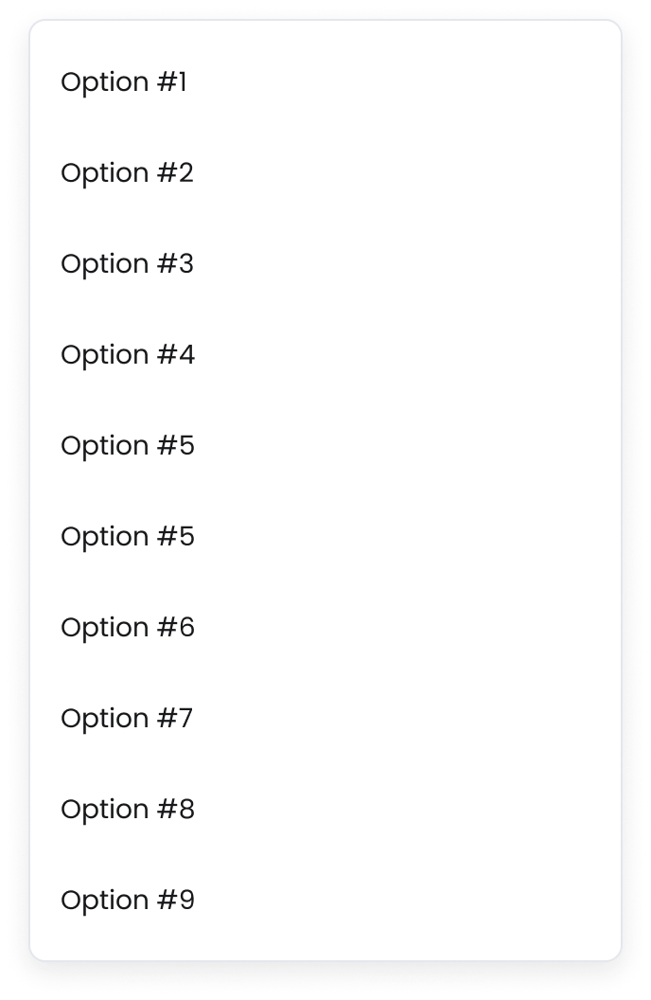
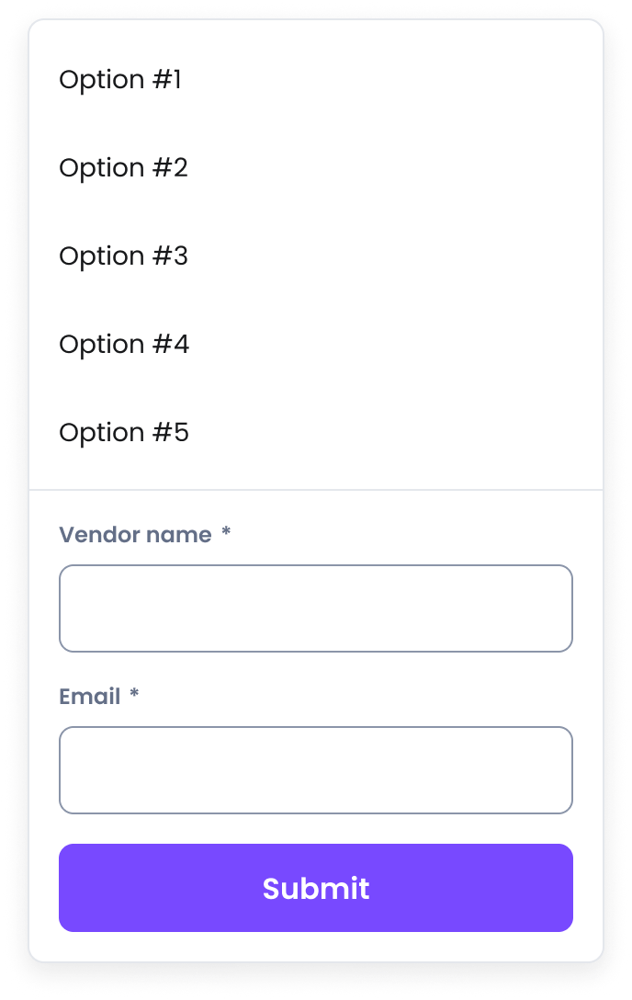

# Menus
[Web URL](https://zeroheight.com/98bb1df01/v/latest/p/153844-menus)
Menus provide users with a list of options or actions.

## Flat menu
A `Flat Menu` opens inline, directly below its trigger. Unlike a `Floating Menu`, it integrates into the page layout and pushes surrounding content down instead of floating above it.

| [Storybook](https://61716025a5ae25003ac448af-kxatgdwswo.chromatic.com/?path=/story/containers-menus-flat-menu-flat-menu-new--with-header) |
| --- |

## Usage

Use the `Flat Menu` in specific scenarios where a floating panel is undesirable, such as the Combobox (in mobile view).

## Mobile

To view the Flat Menu in action, click the combobox (the Search input) and type "New" for results.

>[Storybook](https://61716025a5ae25003ac448af-kxatgdwswo.chromatic.com/?path=/story/selection-inputs-components-combobox-new--mobile-view&globals=viewport:xs)
>
>

## Related components
---

## Floating menu
A `Floating Menu` is an overlay panel that appears next to a trigger element, detached from the page's normal flow. It's the standard menu experience for desktop and other large-viewport layouts.

| [Storybook](https://61716025a5ae25003ac448af-kxatgdwswo.chromatic.com/?path=/story/containers-menus-floating-menu-floating-menu-new--main) |
| --- |

## Usage

The `Floating Menu` is the default desktop behavior for our standard `Menu` patterns.

* **Default Desktop Menu:** When you use the `Menu`, `Actions Menu`, or `Selectable Menu` patterns, they will automatically render as a `Floating Menu` on desktop viewports.
* **Custom Popovers:** Use this component directly to build a custom desktop-specific control that requires complex internal structure, such as sections, dividers, or embedded elements like a search bar.

## Anatomy

**Menu anatomy**

---

### Header

An optional. dedicated slot at the top of the menu. Ideal for a title, a search bar, or a back button for nested navigation.

**Search header**

---

**Back navigation header**

---

### Footer

An optional. dedicated slot at the bottom of the menu for action buttons.

**Floating menu footer with a CTA**

---

## **Sizing**

* **Width:** Can be set to a default fixed width (`240px`), a custom pixel value, or `'match-trigger'` to equal the width of its trigger element.
* **Max Width:** Constrains the width when it's determined by the content, preventing it from becoming too wide.
* **Max Height:** Sets the maximum vertical height (default `256px`) before the content list becomes scrollable.

| [Storybook](https://61716025a5ae25003ac448af-kxatgdwswo.chromatic.com/?path=/story/containers-menus-floating-menu-floating-menu-new--custom-width) |
| --- |

## Patterns

These are ready-to-use components, based on the `Floating Menu` .

### Menu

A simple menu of predefined options.

| [Storybook](https://61716025a5ae25003ac448af-kxatgdwswo.chromatic.com/?path=/story/containers-menus-menu-pattern--main) |
| --- |

### Actions Menu

Use the **Actions Dropdown Menu** for a fast, consistent, and conventional way to add a list of actions.

| [Storybook](https://61716025a5ae25003ac448af-kxatgdwswo.chromatic.com/?path=/story/containers-menus-actions-dropdown-menu-pattern--main) |
| --- |

### Selectable Dropdown Menu

The Selectable Dropdown Menu is ideal for choices where the trigger button dynamically updates to reflect the currently selected value.

| [Storybook](https://61716025a5ae25003ac448af-kxatgdwswo.chromatic.com/?path=/story/containers-menus-selectable-dropdown-menu-pattern--main) |
| --- |

### Sort Dropdown Menu

Use the Sort Dropdown Menu for sorting a list or a table.

| [Storybook](https://61716025a5ae25003ac448af-kxatgdwswo.chromatic.com/?path=/story/containers-menus-sort-dropdown-menu-pattern--main) |
| --- |

## Do's and Don'ts

### ✅ Do
**Use a reasonable maxHeight for compact navigation**
Use a reasonable maxHeight to ensure the menu remains compact and easy to navigate.

### ❌ Don't
**Don't create excessively tall menus**
Create menus that are excessively tall.

---

### ✅ Do
**Use Sections and Dividers to organize menus**
Use Sections and Dividers to organize long or complex menus into logical groups.

### ❌ Don't
**Don't embed complex forms in Floating Menus**
Embed complex forms or multi-step flows within a Floating Menu.

## Mobile use

In mobile view, the items within the `Floating Menu` are displayed in a `Bottom Sheet`.

**Menu - Mobile interpretattion**

---

## Related components
---

## Bottom sheet menu
A `Bottom Sheet Menu` is a modal overlay that slides up from the bottom of the screen. It is the standard menu experience on mobile devices, providing a large, touch-friendly surface for interaction.

| [Storybook](https://61716025a5ae25003ac448af-kxatgdwswo.chromatic.com/?path=/story/containers-menus-bottom-sheet-menu-bottom-sheet-menu-new--main&globals=viewport:xs) |
| --- |

## Usage

The `Bottom Sheet Menu` is the default mobile behavior for our standard `Menu` patterns. In most cases, you will not need to use this component directly.

* **Default Mobile Menu:** When you use the `Menu`, `Actions Menu`, or `Selectable Menu` patterns, they will automatically render as a `Bottom Sheet Menu` on mobile viewports.
* **Custom Mobile Flows:** Use this component directly when designing a unique, mobile-first experience that is not covered by our predefined patterns.

## Anatomy

**Bottom sheet anatomy**

---

1. **Overlay:** A semi-transparent layer that covers the page content, indicating that the menu is active and the background is inert.
2. **Sheet Container:** The main panel that slides up from the bottom, containing all the menu content.
3. **Title (Optional):** A text label at the top of the sheet that clearly explains the purpose of the menu (e.g., "Sort by").
4. **Close Button:** An explicit icon button to dismiss the menu. Users can also typically dismiss it by tapping the overlay.
5. **Content:** The main body of the sheet where the list of items is displayed. If the content exceeds the available height, this area becomes vertically scrollable.
6. **Footer (Optional):** A persistent section at the bottom of the sheet, typically used for primary actions like "Apply" or "Done."

## Related Components
---