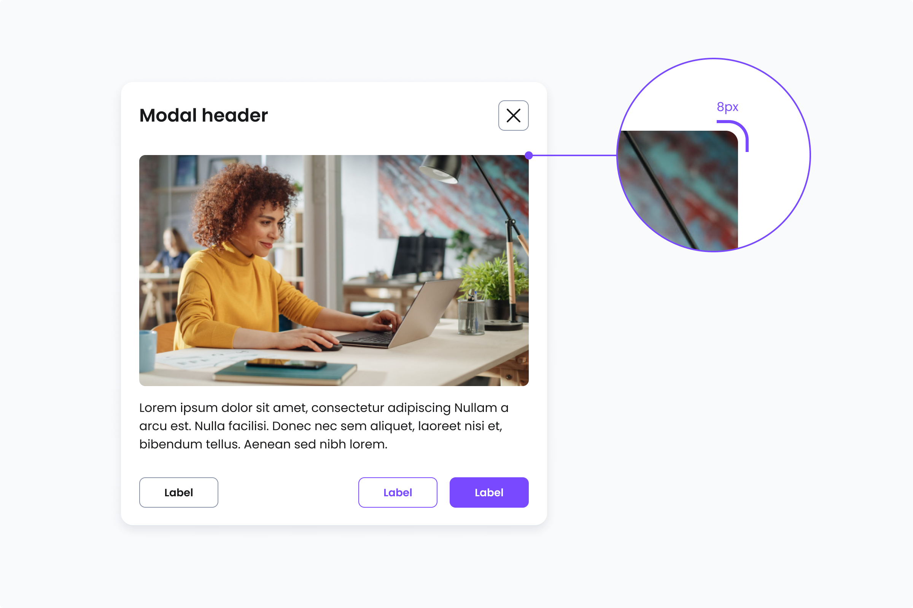
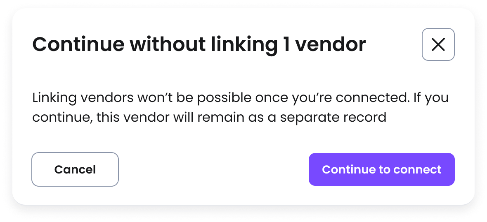

# Modal
[Web URL](https://zeroheight.com/98bb1df01/v/latest/p/216a44-modal)
A modal overlays the main content to display system messages and alerts, preventing background interaction to maintain focus.

| [Storybook](https://penny.melio.com/?path=/story/containers-modals-base-modal--main&globals=viewport:l;theme:melio) |
| --- |

>📌 At Melio, modals are designed for quick interactions, such as confirmations, short forms, and displaying basic information. They should remain lightweight, avoiding complex components like tables or multi-step workflows.

## Usage

* Use modal dialogs to present a short-term task the user needs to perform. This can include critical or warning information where a response is required.
* Also intended to support efficient task completion without losing the context of the underlying page. 
* Users won't be able to interact with the page until the dialog is closed.

## Modal sizes

Modals come in 3 different sizes: 

* Small: 560px
* Medium: 858px
* Large: 100%

| [Storybook](https://penny.melio.com/?path=/story/containers-modals-base-modal--sizes) |
| --- |

### Small: 560px

The small size is more commonly used and usually displays simple confirmations, short forms and messages or alerts.

>

| [Storybook](https://main--63f5f2ea95e88cbf431a8b36.chromatic.com/?path=/story/modal-continue-without-linking-vendors--main) |
| --- |

| [Storybook](https://main--63f5f2ea95e88cbf431a8b36.chromatic.com/?path=/story/screens-memo-to-vendor-modal-memo-to-vendor-modal--main) |
| --- |

>📌 Limit the number of form fields in a modal to five to ensure modals remain focused on short, simple interactions.

### Medium: 858px

The medium-sized modal is used for more product-focused purposes and may include imagery and animation.

>

### Large: 100%

The large size takes up the whole screen, but leaves margins of 32px from the edge of the viewport.

>

### When to use each size

The following table describes when to use which modal size:

| Modal size | Use case |
| --- | --- |
| Small (560px) | Use for quick, focused interactions with minimal content: Simple confirmations. Short messages or alerts. Minimal user input. Micro tasks (e.g., renaming an item). |
| Medium (858px) | Use for moderate interactions that may include additional content or visuals: Forms with multiple fields. Product-related messaging with imagery or animation. Contextual information requiring user action. |
| Large (100%) | Use for complex content that requires more space or comparison: Large tables or data-heavy content. Side-by-side comparisons. Detailed forms or multi-step processes. Embedded media or interactive elements. |

---

## Images in modals

Apply an 8px border radius directly to the image file. The Modal component does not mask images automatically, so the radius must be applied to the asset itself to match the container.

**Modal - Image border radius**

---

## When to use a modal

| ✅ **Use a modal when:** | ❌ **Move to a dedicated Job layout when:** |
| --- | --- |
| The task is **quick and self-contained** (e.g., confirming an action, entering a small amount of data). | The task is **primary and demands full attention** (completing a workflow, filling out a complex form) |
| There are **five or fewer inputs**, keeping the interaction lightweight. | The task requires **more than five inputs**, especially structured inputs (e.g., forms with multiple sections). |
| The modal includes simple components only such as **text**, **image** and **inputs**. | The modal includes tables and other complex components that do not render well at 400% zoom. |

## Do's and Don'ts

### ✅ Do
**Use a modal for quick and self-contained tasks**
Use a modal when the task is quick and self-contained (e.g., confirming an action, entering a small amount of data).

### ❌ Don't
**Don't use modal for primary tasks requiring full attention**
Use a modal when the task is primary and demands full attention (completing a workflow, filling out a complex form)

## Mobile interpretation

Modals receive a different interpretation in mobile, and turn into a Bottom sheet:

>
>*Mobile interpretation of the modal component*

>
>
>[Storybook](https://penny.melio.com/?path=/story/containers-modals-base-modal--main&globals=viewport:l;theme:melio)

---

## Related components