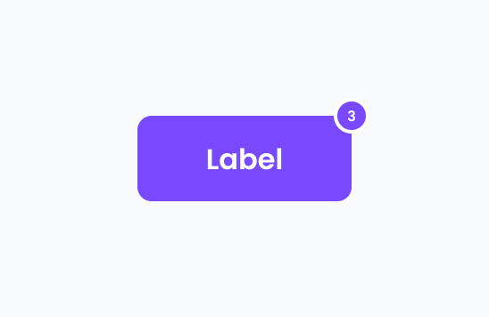
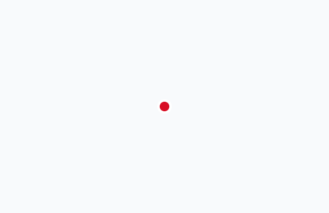

# Badge

import { Tabs, TabItem } from '@astrojs/starlight/components';

[Web URL](https://zeroheight.com/98bb1df01/v/latest/p/1887ca-badge)
Compact visual labels, ideally filled with an icon, counter, or logo, to display key information on elements

## Interactive Example

:::tip[Interactive Testing]
Use the interactive component below to test different states, props, and variations. Toggle between the live component and code examples to understand implementation details.
:::

<Tabs>
<TabItem label="Live Component">
<iframe
  src="https://penny.melio.com/?path=/story/data-display-components-badge--placement"
  width="100%"
  height="500px"
  frameBorder="0"
  allow="clipboard-write"
  style="border: 1px solid #e1e5e9; border-radius: 8px; margin: 16px 0;"
  title="Badge Interactive Example">
</iframe>
</TabItem>

<TabItem label="Code Examples">
```jsx
// Basic Badge with Number
<Badge count={5}>
  <Button>Messages</Button>
</Badge>

// Badge with Icon
<Badge>
  <CheckIcon />
  <span>Verified</span>
</Badge>

// Status Badge
<Badge variant="success">
  <StatusIcon />
  Connected
</Badge>

<Badge variant="warning">
  <WarningIcon />
  Pending
</Badge>

<Badge variant="error">
  <ErrorIcon />
  Failed
</Badge>

// Notification Badge
<Badge count={99} max={99}>
  <NotificationIcon />
</Badge>
```
</TabItem>

<TabItem label="Variants">
```jsx
// Different Positions
<Badge position="top-right" count={3}>
  <Avatar src="/user.jpg" />
</Badge>

<Badge position="bottom-right" count={12}>
  <MessageIcon />
</Badge>

<Badge position="top-left" variant="success">
  <UserCard />
</Badge>

// Custom Content
<Badge>
  <CompanyLogo src="/company-logo.png" />
</Badge>

<Badge>
  <VerifiedIcon />
  <span>Verified Vendor</span>
</Badge>

// With Border (for similar colors)
<Badge showBorder variant="neutral">
  <InfoIcon />
  Information
</Badge>

// Different Sizes
<Badge size="small" count={1}>
  <Icon />
</Badge>

<Badge size="medium" count={10}>
  <Icon />
</Badge>

<Badge size="large" count={100}>
  <Icon />
</Badge>
```
</TabItem>
</Tabs>

[View Full Storybook Documentation →](https://penny.melio.com/?path=/story/data-display-components-badge--placement)

|  **Badge example** |
| --- |

## Usage

Communicate sync status, vendor verification, or other relevant details

## Variants

### Positioning

|  [Storybook](https://penny.melio.com/?path=/story/data-display-components-badge--placement) |
| --- |

### Custom content

| Badges with custom content can accommodate various elements, such as the logo displayed here [Storybook](https://penny.melio.com/?path=/story/data-display-components-badge--custom-content) |
| --- |

## Do's and don'ts

### ✅ Do
**Add a border when its color matches the component's**
Add a border when its color matches the component's


### ❌ Don't
**Don't use color alone for critical information**
Use color alone for critical information; always include clarifying text


## Accessibility

* Ensure sufficient **color contrast** between the badge and its background
* Avoid relying on **color alone** to convey meaning—use icons or text when possible


## Related components