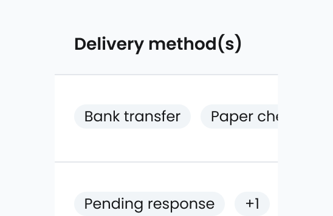

# Pill
[Web URL](https://zeroheight.com/98bb1df01/v/latest/p/68afcb-pill)
The **pill** component is a small, rounded UI element for indicating status, categorizing content, or highlighting key details.

| [Storybook](https://penny.melio.com/?path=/story/data-display-components-pill--main) |
| --- |

## Usage

* **Show status**: Warnings, errors, success, or general info
* **Label content**: Users, companies, transactions
* **Add recognition**: Highlight key details without clutter
* **Use icons**: Add logos, avatars, or symbols for clarity

## Variants

### Types

| [Storybook](https://penny.melio.com/?path=/story/data-display-components-pill--types) |
| --- |

### Statuses

| [Storybook](https://penny.melio.com/?path=/story/data-display-components-pill--statuses) |
| --- |

### Left and right elements

Left and right elements are custom (icons, logos, avatars) but must fit within the 20px pill height.

| [Storybook](https://penny.melio.com/?path=/story/data-display-components-pill--left-and-right-elements) |
| --- |

## Do's and don'ts

### ✅ Do
**Use concise, clear labels**
Use concise, clear labels.

### ❌ Don't
**Don't overuse Pills in dense layouts**
Overuse Pills in dense layouts.

---

### ✅ Do
**Use icons to add meaning or context**
Use icons to add meaning or context.

### ❌ Don't
**Don't use long text strings that break the design**
Use long text strings that break the design.

---

## Mobile use

* Avoid long text to maintain readability

## Use cases

* **User roles**: "Admin" "Viewer" etc
* **Company status**: "Verified"
* **Payments**: "Paid" "Pending" "Failed"
* **Feature tags**: "Beta" "New" "Limited"
* **Icons & logos**: Brand logos, country flags, status icons

## Accessibility

* Don't rely on color alone—use icons and text to ensure clarity for all users, including those with color blindness

## Related components