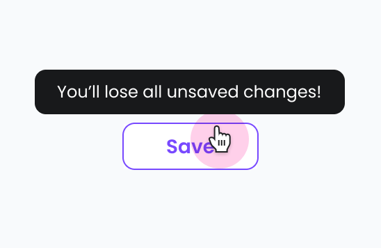

# Tooltip

import { Tabs, TabItem } from '@astrojs/starlight/components';

[Web URL](https://zeroheight.com/98bb1df01/v/latest/p/60e8d6-tooltip)
Tooltip displays brief helper text on hover or focus to clarify an element's purpose without cluttering the UI

## Interactive Example

:::tip[Interactive Testing]
Use the interactive component below to test different states, props, and variations. Toggle between the live component and code examples to understand implementation details.
:::

<Tabs>
<TabItem label="Live Component">
<iframe
  src="https://penny.melio.com/?path=/story/data-display-components-tooltip--main"
  width="100%"
  height="500px"
  frameBorder="0"
  allow="clipboard-write"
  style="border: 1px solid #e1e5e9; border-radius: 8px; margin: 16px 0;"
  title="Tooltip Interactive Example">
</iframe>
</TabItem>

<TabItem label="Code Examples">
```jsx
// Basic Tooltip
<Tooltip content="Save your changes">
  <IconButton icon={<SaveIcon />} />
</Tooltip>

// With Title
<Tooltip 
  title="Payment Status"
  content="This payment was processed successfully"
>
  <StatusBadge variant="success">Paid</StatusBadge>
</Tooltip>

// Multiline Content
<Tooltip content="This is a longer tooltip that spans multiple lines to provide more detailed information">
  <Button variant="secondary">Hover for details</Button>
</Tooltip>

// With Icon in Content
<Tooltip 
  content={
    <div>
      <InfoIcon /> This action cannot be undone
    </div>
  }
>
  <Button variant="danger">Delete Item</Button>
</Tooltip>
```
</TabItem>

<TabItem label="Placement & Control">
```jsx
// Different Placements
<Tooltip content="Top placement" placement="top">
  <Button>Top</Button>
</Tooltip>

<Tooltip content="Right placement" placement="right">
  <Button>Right</Button>
</Tooltip>

<Tooltip content="Bottom placement" placement="bottom">
  <Button>Bottom</Button>
</Tooltip>

<Tooltip content="Left placement" placement="left">
  <Button>Left</Button>
</Tooltip>

// Focus Trigger
<Tooltip content="Available on focus" trigger="focus">
  <input type="text" placeholder="Focus me" />
</Tooltip>

// Controlled Tooltip
const [visible, setVisible] = useState(false);

<Tooltip 
  content="Controlled tooltip"
  visible={visible}
  onVisibleChange={setVisible}
>
  <Button onClick={() => setVisible(!visible)}>
    Toggle Tooltip
  </Button>
</Tooltip>

// Disabled Element with Tooltip
<Tooltip content="This button is currently disabled">
  <span> {/* Wrapper needed for disabled elements */}
    <Button disabled>Disabled Button</Button>
  </span>
</Tooltip>
```
</TabItem>
</Tabs>

[View Full Storybook Documentation →](https://penny.melio.com/?path=/story/data-display-components-tooltip--main)

## Usage

* Explain icon-only buttons or ambiguous UI elements.
* Provide extra information on hover (e.g., "Scheduled to send on May 2").
* Clarify disabled states or restricted access (e.g., "Only admins can edit roles")

>🤓 **Tip**: Tooltips are for hints, not full explanations. If it needs a sentence or more, consider a popover or modal

## Variants

### With title

| [Storybook](https://penny.melio.com/?path=/story/data-display-components-tooltip--with-title)  |
| --- |

### Label with line break

There's no character limit for the tooltip, however the tooltip's max-width is 296px. 

| [Storybook](https://penny.melio.com/?path=/story/data-display-components-tooltip--label-with-line-break)  |
| --- |

### Placement

The tooltip can be placed on either side of the triggering element, give it a try:

| [Storybook](https://penny.melio.com/?path=/story/data-display-components-tooltip--placement)  |
| --- |

### Focus trigger

| [Storybook](https://penny.melio.com/?path=/story/data-display-components-tooltip--should-add-trigger-focus)  |
| --- |

### Label with icon

|  [Storybook](https://penny.melio.com/?path=/story/data-display-components-tooltip--label-with-icon)  |
| --- |

### Controlled

Tooltips can be triggered by events beyond just hovering directly over them

| [Storybook](https://penny.melio.com/?path=/story/data-display-components-tooltip--controlled)  |
| --- |

## Mobile use

Tooltips do **not** appear on hover. For touch devices:

* Use alternative UI (e.g., help icons, modals, or inline text)
* Don't rely on hover-only interactions—ensure all info is accessible

## Do's and don'ts

### ✅ Do
**Use tooltips to explain icon purposes**
Use a tooltip to explain the purpose of an icon when there's no visible label


### ❌ Don't
**Don't use tooltips for critical info**
Use tooltips for critical info


## Accessibility

* Ensure tooltips can be triggered by both **hover** and **keyboard focus**
* Remember that **disabled elements** should still allow users to access their tooltip content
* Keep tooltip text **short, clear, and supportive**, it should never replace essential information
* Tooltips are meant to assist, not block task completion or hide important actions

## Related components