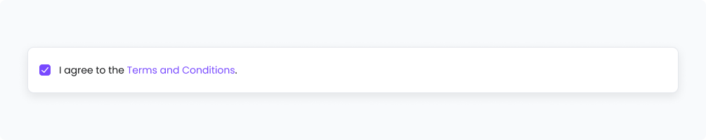

# Checkbox
[Web URL](https://zeroheight.com/98bb1df01/v/latest/p/46dbaf-checkbox)
Checkboxes are most commonly used to give users a way to make a range of selections (zero, one, or multiple).

| [Storybook](https://penny.melio.com/?path=/story/selection-inputs-components-checkbox--main) |
| --- |

## Usage

* When users need to select one or multiple options from a list
* When a setting or preference can be toggled on or off
* When multiple selections are allowed independently (unlike radio buttons, which allow only one)
* When confirming agreement to terms and conditions or consent forms

## Variants

### Size

**Default**

---

**Small**

---

### States

**Rest**

---

**Hover**

---

**Read only**

---

**Disabled**

---

**Invalid**

---

### Selection

**Empty**

---

**Intermediate**

---

**Checked**

---

### Show label

**Show label**

---

## Do's and Dont's

### ✅ Do
**Use a checkbox when multiple items can be selected**
Use a checkbox when multiple items van be selected

### ❌ Don't
**Use radio button for single selection**
If only one item can be selected-use a radio button

## Use cases

Allows the user to select a single option, such as accepting terms of use.

## Related components