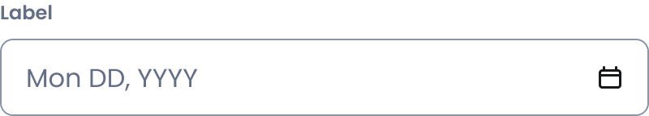

# Date field
[Web URL](https://zeroheight.com/98bb1df01/v/latest/p/731e70-date-field)
The Date Field component serves as an input for selecting dates, providing a user-friendly way to trigger and control the Calendar component. It allows users to manually enter a date or open the Calendar for selection.

| [Storybook](https://penny.melio.com/?path=/story/selection-inputs-components-date-field--main) |
| --- |

>👀 **Note:** For details on sizes, behaviors, and general guidelines applicable to all form components, refer to the**[Form Field](https://zeroheight.com/98bb1df01/p/6854b6-form-field)**documentation.

## Usage

* Clicking the input field triggers the [Calendar](https://zeroheight.com/98bb1df01/v/latest/p/48d510-calendar) component for date selection
    * To open the calendar programmatically, use the 
* In order to allow typing date, use the Typable variant
* After a selection is made:
    * The Calendar menu is closed
    * The date is set

## Do's and Don'ts

### ✅ Do
**Display expected format**
Display a placeholder or helper text indicating the expected format (e.g., "MM/DD/YYYY").

### ❌ Don't
**Don't pre-fill dates unless necessary**
Don't assume a default date unless necessary: Pre-filling a date can lead to accidental selections.

## Content guidelines

[This is a placeholder for Avi and his team]

* What should be the label's verb?

## Related components