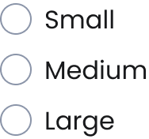

# Radio Group
[Web URL](https://zeroheight.com/98bb1df01/v/latest/p/79a7b5-radio-group)
The Radio Group component allows users to select a single option from a list. It follows standard radio button behavior but includes an option for customizable content.

| [Storybook](https://penny.melio.com/?path=/story/selection-inputs-components-radio-group--main) |
| --- |

>👀 **Note:** For details on sizes, behaviors, and general guidelines applicable to all form components, refer to the**[Form Field](https://zeroheight.com/98bb1df01/p/6854b6-form-field)**documentation.

## Usage

* Use when a user must choose one option from a predefined set.
* Ensure all options are clearly labeled and easy to understand.
* Use the customizable content to provide additional context when needed.
* Group related radio buttons together with a clear heading

## Variants

### Within a Form Field

Nesting the Radio Group within a Form Field enables helper text and improves form organization.

| [Storybook](https://penny.melio.com/?path=/story/selection-inputs-components-radio-group--with-form-field) |
| --- |

### Orientation

The Radio Group is available in two orientations: horizontal and vertical:

| [Storybook](https://penny.melio.com/?path=/story/selection-inputs-components-radio-group--variants) |
| --- |

### States

Both the Selected and Unselected variants share the same states:

#### Unselected

**Rest**

---

**Hover**

---

**Read only**

---

**Disabled**

---

**Invalid**

---

#### Selected

**Rest**

---

**Hover**

---

**Read only**

---

**Disabled**

---

**Invalid**

---

### With Badge, Icon and Description

The Radio component allows you to enhance the label with an icon, badge, and an additional description line to provide better context and clarity for the user.

**Radio - with Description + icon + badge**

---

### Custom Option Content

The Radio group uses a slot to render its content, allowing you to customize it as needed.

![🤍Radio [ Custom ]](./assets/radio-group-image-12.png)

**🤍Radio [ Custom ]**

---

## Do's and Dont's

### ✅ Do
**Use radio buttons for mutually exclusive options**
Use radio buttons for mutually exclusive options

### ❌ Don't
**Don't nest radio buttons**
Don't nest radio buttons

## Related components