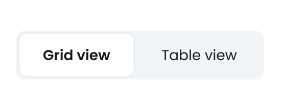

# Segmented control
[Web URL](https://zeroheight.com/98bb1df01/v/latest/p/3999b7-segmented-control)
Segmented control enables users to toggle between different views or sections. It efficiently organizes related options horizontally, allowing quick transitions without leaving the current context. 

| [Storybook](https://penny.melio.com/?path=/story/selection-inputs-components-segmented-control-new-segmented-control--main) |
| --- |

## Usage

* Segmented control allow users to toggle between alternate views of similar or related content, showing only one content section at a time.
* Should be used to change the way a piece of content or data is formatted on the page. It doesn't trigger changes to the content or data itself.
* The main action of a button group will be in selected mode.

>🤓 **Am I using the right component?** : Keep the content short and actionable. For longer content, use the Select component.

## Variants

### Sizes

Small- 32px height

Medium - 40px height 

Large- 48px height 

[Storybook](https://penny.melio.com/?path=/story/selection-inputs-components-segmented-control-new-segmented-control--sizes)

### Width 

| Hug content  | Full width  |
| :---: | :---: |
| [Storybook](https://penny.melio.com/?path=/story/selection-inputs-components-segmented-control-new-segmented-control--main) | [Storybook](https://penny.melio.com/?path=/story/selection-inputs-components-segmented-control-new-segmented-control--full-width) |

## Do's and don'ts

### ✅ Do
**Keep labels short and limit segments**
Segmented controls should have short labels and a limited number of segments.

### ❌ Don't
**Avoid long labels or too many segments**
Avoid long, complex labels or too many segments. Use a select or combobox instead.

---

### ✅ Do
**Use for toggling between related content**
Use a segmented button to toggle between related content without navigating the user to another page.

### ❌ Don't
**Use tabs for distinct content areas**
Don't use segmented control to switch between distinct content areas. Use Tabs instead.

## Related components 