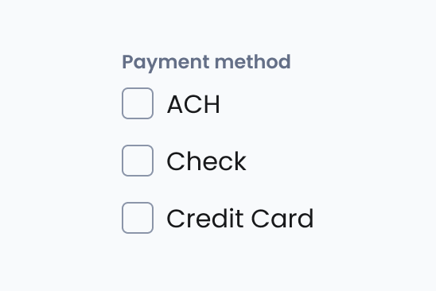

# Switch

import { Tabs, TabItem } from '@astrojs/starlight/components';

[Web URL](https://zeroheight.com/98bb1df01/v/latest/p/78000a-switch)
The Switch (Toggle) component allows users to enable or disable a setting with a single tap or click. It represents a binary state (on/off) and is commonly used for preferences, settings, and feature toggles.

## Interactive Example

:::tip[Interactive Testing]
Use the interactive component below to test different states, props, and variations. Toggle between the live component and code examples to understand implementation details.
:::

<Tabs>
<TabItem label="Live Component">
<iframe
  src="https://penny.melio.com/iframe.html?id=selection-inputs-components-switch--main&viewMode=story"
  width="100%"
  height="500px"
  frameBorder="0"
  allow="clipboard-write"
  style="border: 1px solid #e1e5e9; border-radius: 8px; margin: 16px 0;"
  title="Switch Interactive Example">
</iframe>
</TabItem>

<TabItem label="Code Examples">
```jsx
// Basic Switch
<Switch 
  name="notifications" 
  defaultChecked={false}
  onChange={(checked) => console.log('Switch toggled:', checked)}
/>

// With Label
<Switch name="email-alerts" defaultChecked>
  Enable email alerts
</Switch>

// With Form Field
<FormField label="Privacy Settings">
  <Switch name="profile-visible" defaultChecked>
    Make profile visible to others
  </Switch>
</FormField>

// Controlled Switch
const [isEnabled, setIsEnabled] = useState(false);

<Switch 
  checked={isEnabled}
  onChange={setIsEnabled}
  name="feature-toggle"
>
  Enable new features
</Switch>
```
</TabItem>

<TabItem label="States & Sizes">
```jsx
// Different Sizes
<Switch size="small" name="small-switch">
  Small switch
</Switch>

<Switch size="medium" name="medium-switch">
  Medium switch
</Switch>

// Different States
<Switch name="enabled" defaultChecked>
  Enabled switch
</Switch>

<Switch name="disabled" disabled>
  Disabled switch (off)
</Switch>

<Switch name="disabled-on" disabled defaultChecked>
  Disabled switch (on)
</Switch>

<Switch name="readonly" readOnly defaultChecked>
  Read-only switch
</Switch>

// Full Width
<Switch name="fullwidth" fullWidth>
  Full width switch with longer description text
</Switch>
```
</TabItem>
</Tabs>

[View Full Storybook Documentation →](https://penny.melio.com/?path=/story/selection-inputs-components-switch--main)

>👀 **Note:** For details on sizes, behaviors, and general guidelines applicable to all form components, refer to the[ ](https://zeroheight.com/98bb1df01/p/6854b6-form-field)**[Form Field](https://zeroheight.com/98bb1df01/p/6854b6-form-field)**[ ](https://zeroheight.com/98bb1df01/p/6854b6-form-field)documentation.

## Usage

Switches are best used to adjust settings and other standalone options. They make a binary selection, like on and off or true and false.

The effects of a switch should start immediately, without needing to save.

Use a Switch to:

* Toggle a single item on or off
* Immediately activate or deactivate something

>🤓 **Tip**: Switches control binary options, not opposing ones. A light can be turned OR off, however the AC can't be set on hot OR cold, but rather a range of degrees.

## Variants

### Sizes

The switch is available in 2 sizes: 16px and 20px high, however both have a 24px target area, in order to adhere to accessibility guidelines.

| [Storybook](https://penny.melio.com/?path=/story/selection-inputs-components-switch--sizes) |
| --- |

### States

#### Off


**Enabled**

---


**Read only**

---


**Disabled**

---

#### On


**Enabled**

---


**Read only**

---


**Disabled**

---

### Full width

| [Storybook](https://penny.melio.com/?path=/story/selection-inputs-components-switch--full-width) |
| --- |

## Do's and Don'ts

### ✅ Do
**Use a switch when the option is binary**
Use a checkbox when the option is binary.


### ❌ Don't
**Don't use radio for binary options**
Don't use radio for binary options.


---

### ✅ Do
**Use checkboxes for multiple selections**
Use checkboxes (not switches) to let users select one or more options from a list.


### ❌ Don't
**Avoid switches for options requiring save actions**
Avoid using a switch to select multiple options that require people to save. Switches should be immediate. Use checkboxes instead.


## Related components 