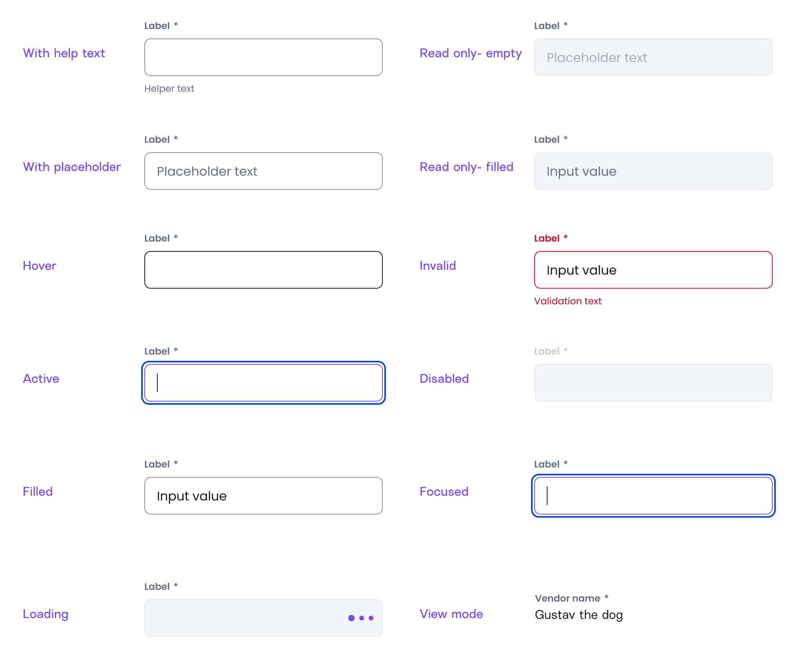

# Text field

import { Tabs, TabItem } from '@astrojs/starlight/components';

[Web URL](https://zeroheight.com/98bb1df01/v/latest/p/84d686-text-field)
The Text Field component is a fundamental input element that allows users to enter and edit text. It is used for capturing short textual input, such as names, email addresses, or search queries.

## Interactive Example

:::tip[Interactive Testing]
Use the interactive component below to test different states, props, and variations. Toggle between the live component and code examples to understand implementation details.
:::

<Tabs>
<TabItem label="Live Component">
<iframe
  src="https://penny.melio.com/?path=/story/form-text-field--main"
  width="100%"
  height="500px"
  frameBorder="0"
  allow="clipboard-write"
  style="border: 1px solid #e1e5e9; border-radius: 8px; margin: 16px 0;"
  title="Text Field Interactive Example">
</iframe>
</TabItem>

<TabItem label="Code Examples">
```jsx
// Basic Text Field
<TextField
  name="firstName"
  placeholder="Enter your first name"
  onChange={(value) => console.log('Value changed:', value)}
/>

// With Form Field
<FormField label="Email Address" required>
  <TextField
    type="email"
    name="email"
    placeholder="user@example.com"
    helperText="We'll never share your email"
  />
</FormField>

// With End Element (Icon)
<TextField
  name="search"
  placeholder="Search..."
  endElement={<SearchIcon />}
/>

// Password Field
<TextField
  type="password"
  name="password"
  placeholder="Enter password"
  endElement={<EyeToggleIcon />}
/>
```
</TabItem>

<TabItem label="Advanced Features">
```jsx
// With Input Masking
<TextField
  name="creditCard"
  placeholder="1234 5678 9012 3456"
  mask="9999 9999 9999 9999"
  helperText="Enter your 16-digit card number"
/>

<TextField
  name="phone"
  placeholder="(555) 123-4567"
  mask="(999) 999-9999"
  helperText="Enter your phone number"
/>

// Different Sizes
<TextField size="small" placeholder="Small text field" />
<TextField size="large" placeholder="Large text field" />

// Validation States
<TextField
  name="required-field"
  placeholder="This field is required"
  error="This field is required"
  required
/>

<TextField
  name="valid-field"
  placeholder="Valid input"
  value="valid@email.com"
  valid
/>

// Disabled State
<TextField
  name="disabled"
  placeholder="Disabled field"
  disabled
  value="Cannot edit this"
/>
```
</TabItem>
</Tabs>

[View Full Storybook Documentation →](https://penny.melio.com/?path=/story/form-text-field--main)

## Usage

* Text fields are normally found within a form but can also be part of a modal, search, or card.
* Make sure your text field has a short, descriptive label above it that describes what the user should type into the box below.
* Use `label` elements or `aria-label` for screen readers.

>👀 **Note:** For details on sizes, behaviors, and general guidelines applicable to all form components, refer to the[ ](https://zeroheight.com/98bb1df01/p/6854b6-form-field)**[Form Field](https://zeroheight.com/98bb1df01/p/6854b6-form-field)**[ ](https://zeroheight.com/98bb1df01/p/6854b6-form-field)documentation.

## Anatomy


**Anatomy**

---

## Variants

### Sizes

Small- 40px height     |     Large- 48px height 

[Storybook](https://penny.melio.com/?path=/story/form-text-field--sizes)

### States



**Asset States**

---

## Capabilities 

| **Masking**  The text field supports masking capabilities, allowing formatted inputs such as credit card details and dates. Masking helps users enter data correctly by enforcing a predefined format.   | [Storybook](https://penny.melio.com/?path=/story/form-text-field--dynamic-mask)  |
| --- | --- |
|  **End element **  The text field supports masking capabilities, allowing formatted inputs such as credit card details and dates. Masking helps users enter data correctly by enforcing a predefined format.   |   |

## Do's and don'ts

### ✅ Do
**Use helper text for formatting tips and context**
Use helper text for formatting tips, additional context, or clarifications.


### ❌ Don't
**Avoid critical information in placeholders**
Avoid putting critical information in placeholders—they disappear when typing.


## Related components 