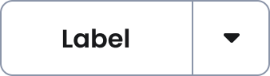
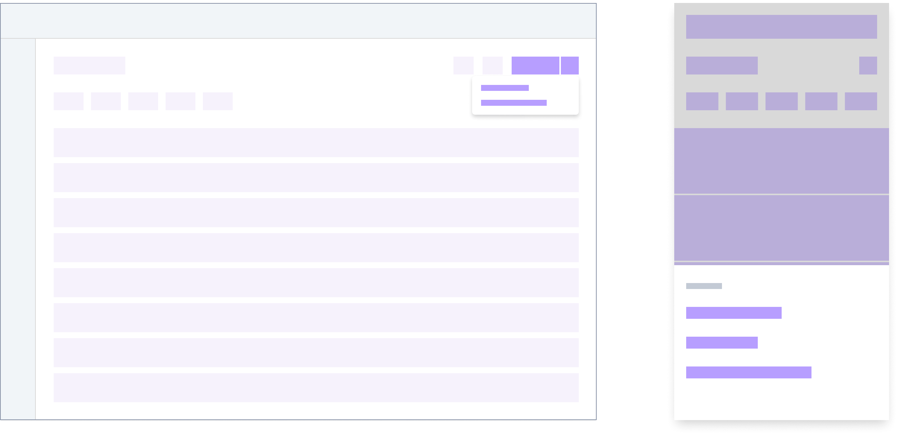

# Split Button 
[Web URL](https://zeroheight.com/98bb1df01/v/latest/p/88903e-split-button)
A Split Button provides a primary, default action while also grouping a set of secondary, related actions into a dropdown menu.

## Usage

Use the Split Button to **provide a closely-related option** without complicating the primary user flow. Some examples: 

### Example #1

Primary action: "Save" 

* Secondary action: "Save as Template"

### Example #2

Primary action: "Create bill" 

* Secondary action: "Import from spreadsheet"
* Secondary action: "Add from Gmail"

**Split button recommended usage**

---

>🤓 **Tip**: Make the default action predictable, users shouldn't have to open the dropdown menu to understand the component's primary function.

## Variants

### Types

The Split Button is available in all types to match its level of emphasis and context on the page, however try and constrain usage to the regular, positive variants: **Primary** and **Tertiary**. 

#### Recommended use

**Primary**

---

**Tertiary**

---

#### You better have a good reason

**Critical**

---

**Critical Secondary**

---

**Secondary**

---

### Sizes

**Large**

---

**Medium**

---

**Small**

---

## Mobile use

In mobile, primary and secondary options appear in a bottom sheet.

**Split button - Mobile interpretattion**

---

## Related components