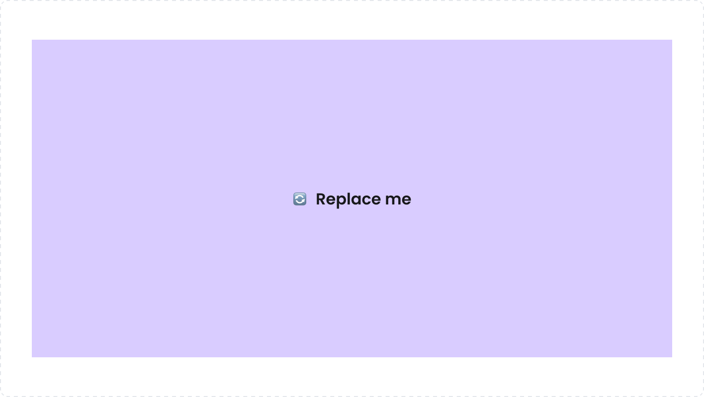
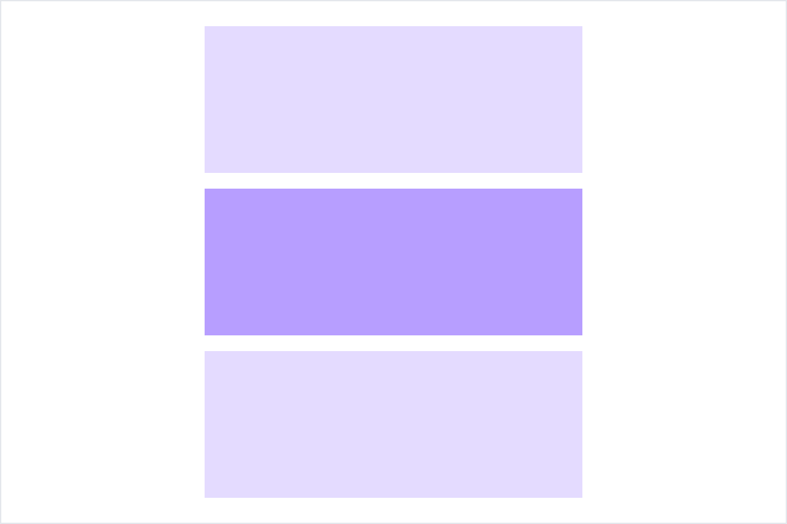

# Container
[Web URL](https://zeroheight.com/98bb1df01/v/latest/p/499555-container)
The Container is used to wrap content and control spacing, alignment, and layout boundaries. It's highly flexible and helps maintain consistency across the interface by providing structure and padding.

| [Storybook](https://penny.melio.com/?path=/story/containers-container--main) |
| --- |

## Usage

Use it when you need to:

* Create sections or blocks of content
* Apply consistent spacing and alignment
* Apply background color and borders to differentiate sections
* Control dimensions and overflow behavior

>💡 Need an interactive component? Use the [Card](https://zeroheight.com/98bb1df01/p/256920-card) component instead. 

##  Key Features

* Flexible padding on all sides–padding is customizable for all 4 sides, e.g. "24px, 16px, 24px, 8px"
* Optional borders and background colors
* Layout control with width, height, and alignment props
* Sticky positioning support

## Variants

### Background colors

Defines the background color of the container, to either:

* **Default**: Transparent background
* **Light**: Which uses the `semantic-surface-secondary-rest` color
* **White:** White background

| [Storybook](https://penny.melio.com/?path=/story/containers-container--backgrounds) |
| --- |

### Border

Defines the border style of the container:

**Border: None**

---

**Border: Solid**

---

**Border: Dashed**

---

## Size

### Width

Defines the width of the container, wether it is `hug-content` or `fill-container`

| [Storybook](https://penny.melio.com/?path=/story/containers-container--width) |
| --- |

### Height

Defines the height of the container, wether it is `hug-content` or `fill-container`

| [Storybook](https://penny.melio.com/?path=/story/containers-container--height) |
| --- |

### maxWidth

For finer control over the container's width, use the maxWidth property to set the maximum allowed width. Accepts CSS max-width values (e.g., 640px, 100%).

## Positioning

Use the position setting to define how the container is placed in the layout:

**Static positioning (Default)**

---

**Relative positioning**

---

**Absolute positioning**

---

**Fixed positioning**

---

**Sticky positioning**

---

## Related components