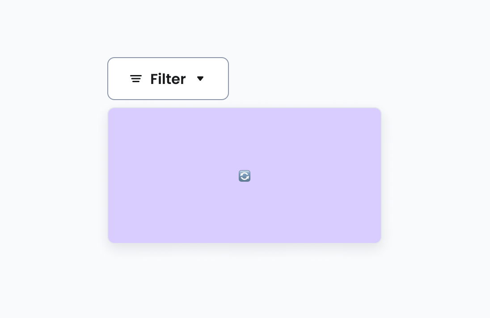
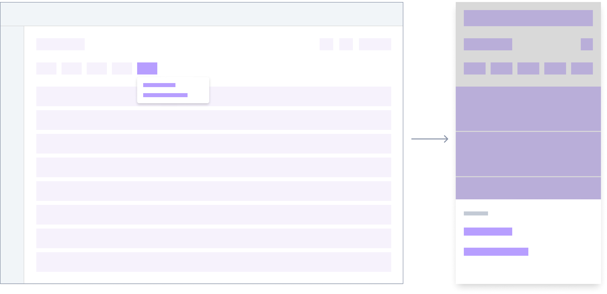

# Floating
[Web URL](https://zeroheight.com/98bb1df01/v/latest/p/11c0dc-floating)
A container for floating content, connected to a trigger element.

| [Storybook](https://61716025a5ae25003ac448af-kxatgdwswo.chromatic.com/?path=/story/containers-floating-new--main) |
| --- |

## Usage

* Use when additional context or actions need to appear relative to a specific UI element
* Leverages dynamic placement to ensure content remains visible within the viewport, adjusting automatically if screen space is limited.

## Trigger

While buttons are the standard trigger, the component supports any element as its trigger.

**Button trigger**

---

**Custom trigger**

---

>📌 Ensure a minimum of 24*24px target for the custom trigger

## Mobile use

On mobile devices, screen real estate is limited. While the Floating component attempts to adjust placement, consider if a **Bottom Sheet** or full-screen adaptation is a better experience for complex forms (like linking a bank account) on small screens.

**Floating - Mobile interpretattion**

---

## Related components