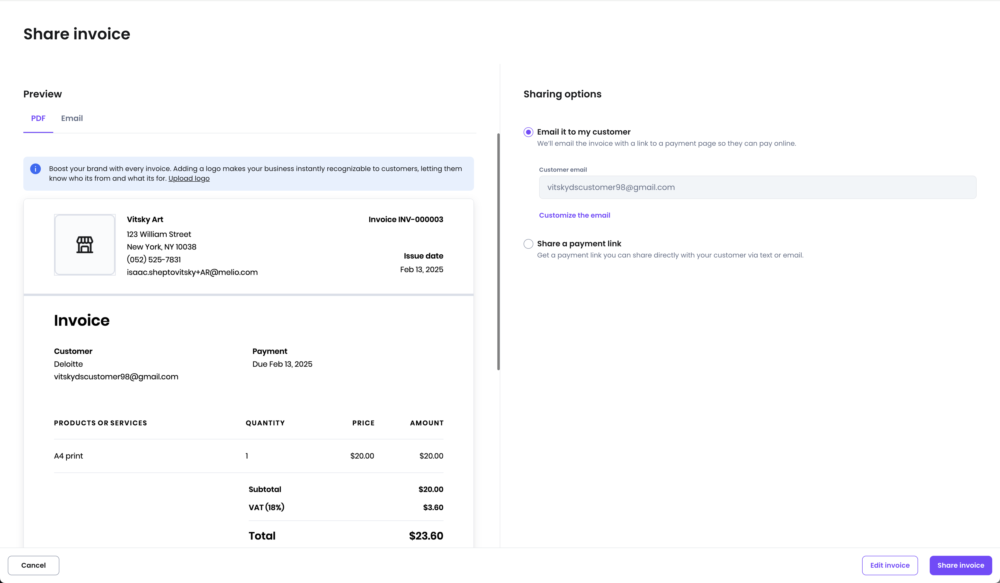

# Split layout
[Web URL](https://zeroheight.com/98bb1df01/v/latest/p/9191e9-split-layout)
Unlike other layouts, the split layout doesn't convey a specific function or meaning. Instead, it simply organizes elements into two horizontally arranged panels

>
>*1:1 split layout*

## Variants

There are 3 types for the Split layout:

>

### Container width

Each panel has its own container, and each container can have its own max-width.

>

Learn more about container widths [here](https://zeroheight.com/98bb1df01/p/63ec5f-layout/t/7f7c9f8fd3).

### Common use

The most common use of the Split layout is pairing a job with an asset, such as sharing an invoice, where the invoice appears on the left and actions on the right.

>
>*Share invoice screen using the 1:1 variant*

>
>*Bill screen using the 1:2 variant*

### Mobile interpretation

On mobile devices, the split layout is rearranged to a vertical layout:

>
>*The panels are rearranged to be stacked vertically*