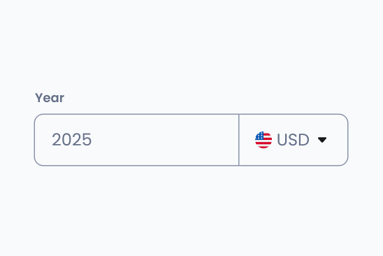
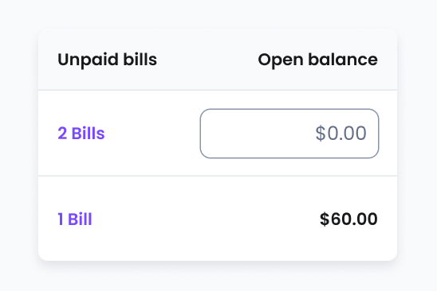

# Amount field
[Web URL](https://zeroheight.com/98bb1df01/v/latest/p/30ad65-amount-field)
The Amount Field component is an input field designed for entering monetary values in different currencies. It supports left and right text alignment and can include an optional End Element, typically used for currency selection.

| [Storybook](https://penny.melio.com/?path=/story/selection-inputs-components-amount-field--main) |
| --- |

>👀 **Note:** For details on sizes, behaviors, and general guidelines applicable to all form components, refer to the**[Form Field](https://zeroheight.com/98bb1df01/p/6854b6-form-field)**documentation.

## Usage

* Used to input monetary values in a structured and formatted manner.
* Supports **left or right text alignment** based on user preference or localization needs.
* Can include an **End Element** (e.g., a dropdown) for selecting a currency.
* This component includes built-in formatting, optional unit display, and validation to prevent incorrect entries.

## Variants

### End element

The end element allows selecting a different currency for the amount.

| [Storybook](https://penny.melio.com/?path=/story/selection-inputs-components-amount-field--end-element) |
| --- |

## Do's and Don'ts

### ✅ Do
**Use for monetary values with currency selection**
Use for monetary values where currency selection may be required.

### ❌ Don't
**Don't use for generic numerical input**
Don't use for generic numerical input unrelated to currency

---

### ✅ Do
**Align text according to context**
Align the text according to the context. Usually to the right when in tables.

### ❌ Don't
**Avoid inconsistent alignment**
Avoid inconsistent alignment within a form or application.

## Related components