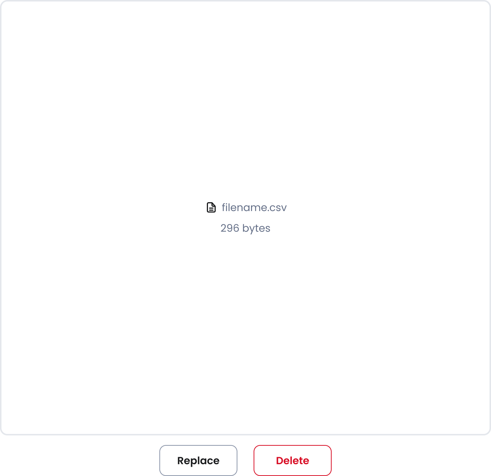
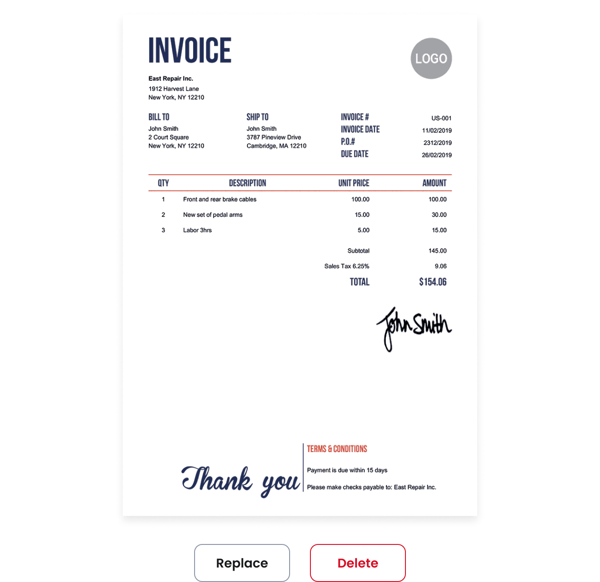
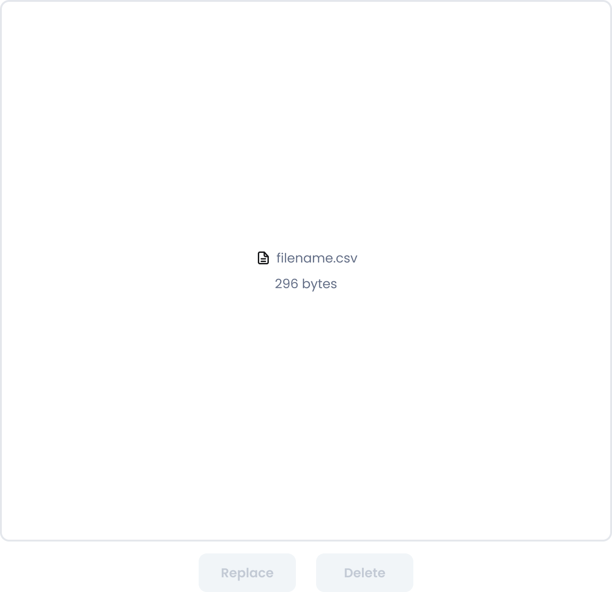
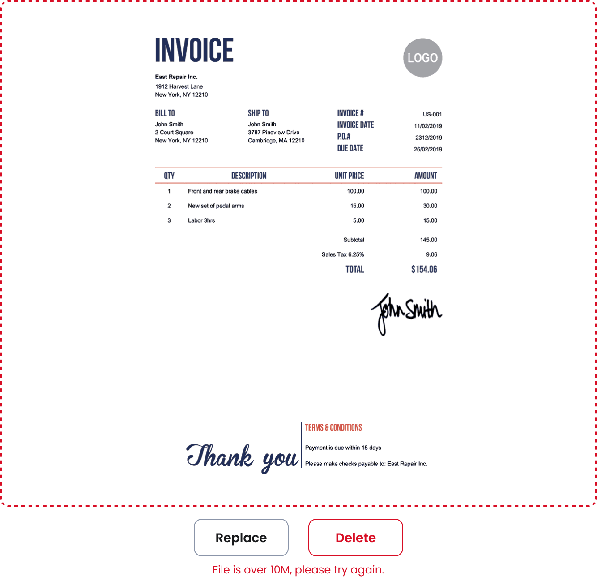

# Large file upload
[Web URL](https://zeroheight.com/98bb1df01/v/latest/p/248e54-large-file-upload)
Allows users to upload large files by either dragging and dropping them into a designated area on the page or clicking a button. Uploaded files are displayed with a preview.

>#### Upload a file to interact with the Large file uploader
>
>[Storybook](https://penny.melio.com/iframe.html?globals=&args=&id=selection-inputs-components-large-file-upload--main)
>
>

## Usage

* The component is accepts files of specific formats and either displays a preview or not, depending on the file format
* Supported files:
    * CSV
    * JPEG (Preview)
    * JSON
    * PDF (Preview)
    * PNG (Preview)
    * SVG (Preview)
* After a file has been uploaded, the user is allowed to:
    * Delete uploaded file
    * Replace uploaded file

## Variants

### No attachment

**No attachement**

---

### With attachment

#### Types

There are 2 main variants to the Large file upload attachment state:

**Preview**

---

**No preview**

---

#### States

**Preview - Enabled**

---

**No preview - Enabled**

---

**Preview - Read only**

---

**No preview - Read only**

---

**Preview - Disabled**

---

**No preview - Disabled**

---

**Preview - Loading**

---

**No preview - Loading**

---

**Preview - Error**

---

**No preview - Error**

---

## Custom content

You can customize both the Asset and the Text:

[Storybook](https://penny.melio.com/?path=/story/selection-inputs-components-large-file-upload--custom-placeholder)

## Accessibility

Displaying the full filename isn't required to meet accessibility guidelines, but we have chosen to include it.

## Related components