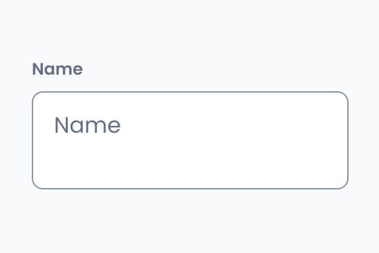

# Text area

import { Tabs, TabItem } from '@astrojs/starlight/components';

[Web URL](https://zeroheight.com/98bb1df01/v/latest/p/627fc8-text-area)
The Text Area component is a multi-line text input, allowing users to enter longer content such as descriptions, messages, or comments. 

## Interactive Example

:::tip[Interactive Testing]
Use the interactive component below to test different states, props, and variations. Toggle between the live component and code examples to understand implementation details.
:::

<Tabs>
<TabItem label="Live Component">
<iframe
  src="https://penny.melio.com/iframe.html?id=selection-inputs-components-text-area--main&viewMode=story"
  width="100%"
  height="500px"
  frameBorder="0"
  allow="clipboard-write"
  style="border: 1px solid #e1e5e9; border-radius: 8px; margin: 16px 0;"
  title="Text Area Interactive Example">
</iframe>
</TabItem>

<TabItem label="Code Examples">
```jsx
// Basic Text Area
<TextArea
  name="description"
  placeholder="Enter your description..."
  numberOfRows={4}
  onChange={(value) => console.log('Text changed:', value)}
/>

// With Form Field
<FormField label="Comments" helperText="Share your thoughts">
  <TextArea
    name="comments"
    placeholder="Write your comments here..."
    numberOfRows={6}
  />
</FormField>

// With Character Limit
<FormField label="Feedback" showCharCount>
  <TextArea
    name="feedback"
    placeholder="Provide your feedback..."
    maxChars={500}
    numberOfRows={5}
  />
</FormField>

// Auto-resizing Text Area
<TextArea
  name="notes"
  placeholder="Start typing your notes..."
  autoResize
  minRows={3}
  maxRows={10}
/>
```
</TabItem>

<TabItem label="Form Integration">
```jsx
// In a Form
<form onSubmit={handleSubmit}>
  <FormField label="Message" required>
    <TextArea
      name="message"
      placeholder="Type your message..."
      numberOfRows={4}
      required
    />
  </FormField>
  
  <FormField label="Additional Notes" showCharCount>
    <TextArea
      name="notes"
      placeholder="Any additional information..."
      maxChars={1000}
      numberOfRows={3}
    />
  </FormField>
  
  <Button type="submit">Send Message</Button>
</form>

// Validation States
<TextArea
  name="required-field"
  placeholder="This field is required"
  error="Please enter at least 10 characters"
  numberOfRows={3}
/>

<TextArea
  name="valid-field"
  placeholder="Valid input"
  value="This is a valid message with enough content."
  valid
  numberOfRows={3}
/>

// Disabled State
<TextArea
  name="disabled"
  placeholder="Cannot edit this field"
  disabled
  value="This content cannot be modified"
  numberOfRows={3}
/>
```
</TabItem>
</Tabs>

[View Full Storybook Documentation →](https://penny.melio.com/?path=/story/selection-inputs-components-text-area--main)

## Usage

* Unlike a standard text field, which is intended for single-line input, the text area is optimized for handling large amounts of text with improved usability and visibility.
* Use a text area when users need to enter multiple lines of text, such as: comments and feedback forms, descriptions and notes, messages or email drafts

>👀 **Note:** For details on sizes, behaviors, and general guidelines applicable to all form components, refer to the[ ](https://zeroheight.com/98bb1df01/p/6854b6-form-field)**[Form Field](https://zeroheight.com/98bb1df01/p/6854b6-form-field)**[ ](https://zeroheight.com/98bb1df01/p/6854b6-form-field)documentation.

## Variants

### Size

The input has a default height of 4 rows, which is the equivalent of 128px. The default height could be set by overriding the default `numberOfRows` to a different value.

### Max chars

* **Character Limit**: Use the `maxChars` prop to define the maximum number of characters allowed (e.g., `maxChars={10}`).
* **Visual Counter**: To display the character count, wrap the `TextArea` component in a `FormField`.

[Storybook](https://penny.melio.com/?path=/story/form-form-field--with-max-chars)

## Do's and don'ts

### ✅ Do
**Use a text area for multiple lines of text**
Use a text area when users need to enter multiple lines of text.


### ❌ Don't
**Don't use text area for short single-line inputs**
Don't use a text area for short inputs where a single-line text field is more appropriate.


## Related components 